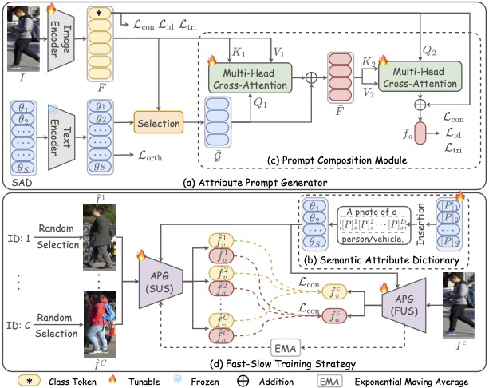
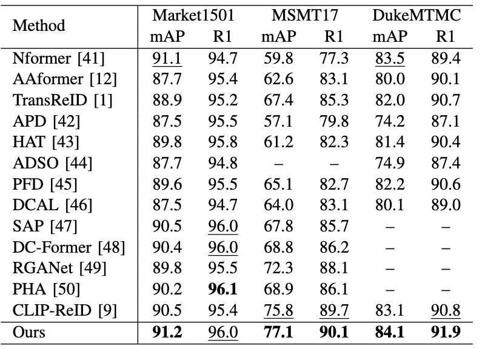
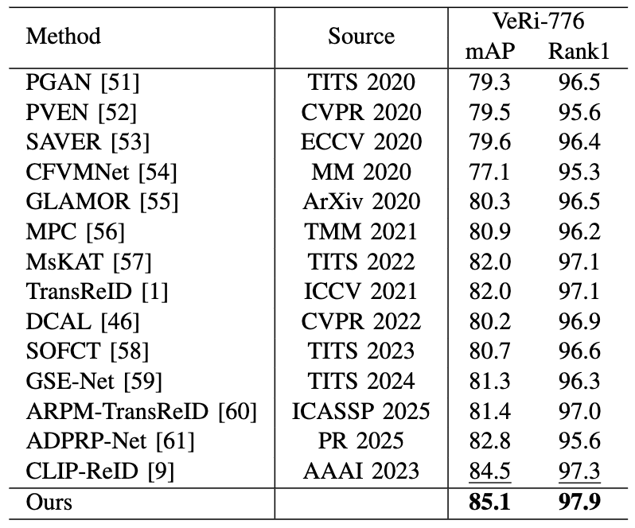
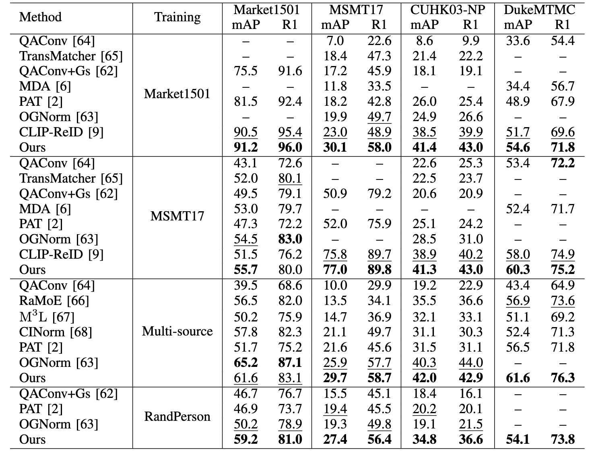
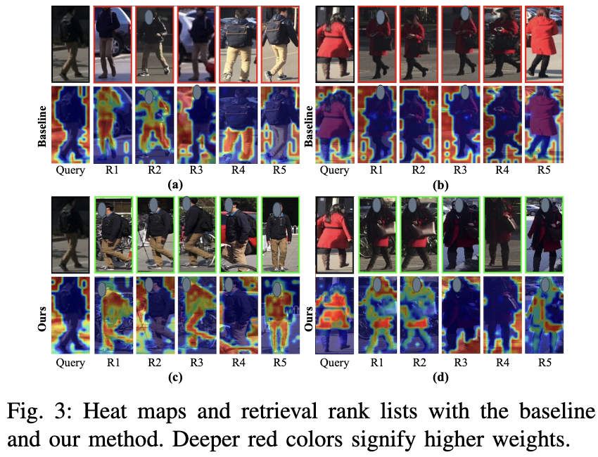
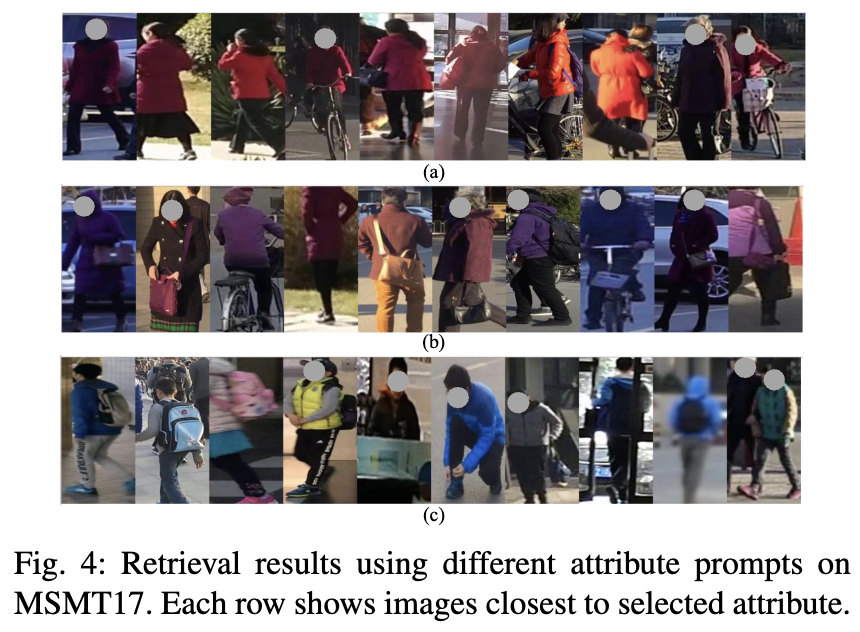
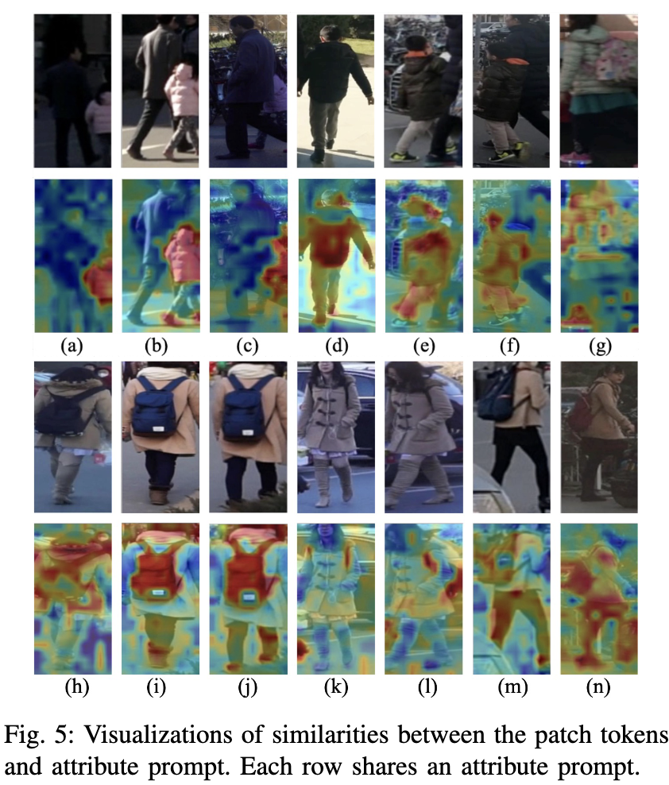
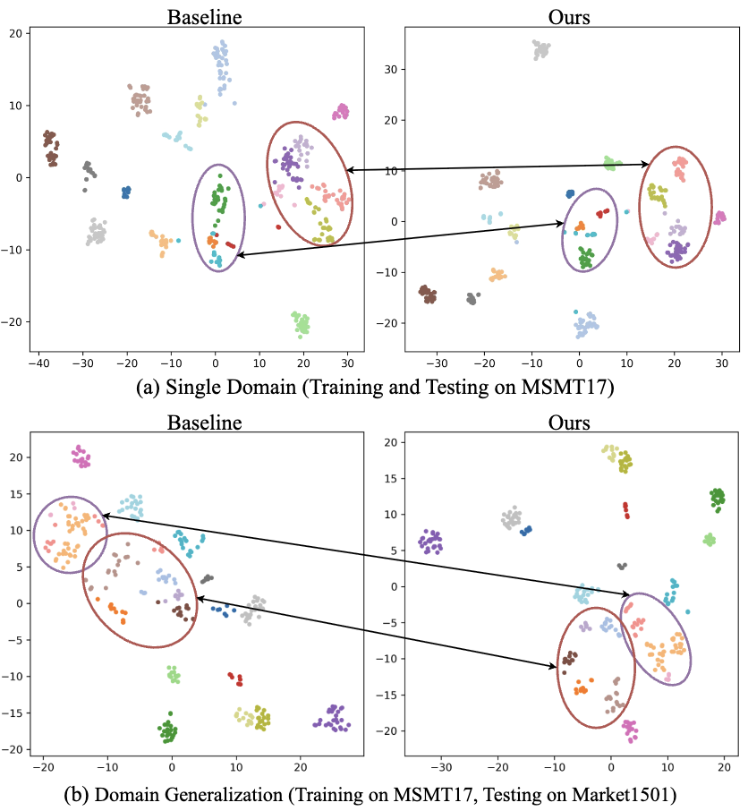

<div align="center">

# What Makes You Unique? Attribute Prompt Composition for Object Re-Identification

<a href="https://ieeexplore.ieee.org/abstract/document/11184208" target="_blank">TCSVT 25 Paper</a>

</div>



**APC** is a powerful vision–language–driven solution for object Re-identification (ReID), designed to capture fine-grained identity cues while maintaining strong generalization across diverse visual domains. By modeling each object as a composition of discriminative semantic attributes, APC overcomes the limitations of traditional single-domain and cross-domain ReID methods, which often suffer from domain shift or the suppression of critical identity features. Through a comprehensive Semantic Attribute Dictionary and an adaptive Prompt Composition Module, APC effectively aggregates instance-relevant attributes to enhance feature robustness. Furthermore, its Fast–Slow Training Strategy balances task-specific discrimination with the generalizable perceptual priors inherited from pre-trained vision-language models. Together, these components enable APC to achieve state-of-the-art performance across conventional, domain-generalized, and synthetic-to-real ReID tasks, demonstrating its strong potential for real-world, open-domain re-identification scenarios.

# News

Exciting news! Our paper has been accepted by the TCSVT 2025! 🎉 [Paper](https://arxiv.org/abs/2509.18715)

# Table of Contents

- [Introduction](#introduction)
- [Contributions](#contributions)
- [Results](#results)
- [Visualizations](#visualizations)
- [Reproduction](#reproduction)
- [Citation](#citation)

# Introduction

Object ReID in real-world applications often suffers from domain variations, where images collected across different environments or camera views exhibit substantial appearance shifts. This makes it challenging for models to maintain both discriminative power and robust generalization. **APC** addresses these challenges by leveraging the rich semantic priors of vision–language models to construct attribute-aware representations that remain stable across domains. By composing objects from multiple adaptive attribute prompts and guiding representation learning through a Fast–Slow training strategy, APC effectively reduces domain sensitivity while preserving fine-grained identity cues, enabling superior performance in both conventional and domain-generalized ReID scenarios.

# Contributions

- We propose a novel framework named Attribute Prompt Composition (APC) for object ReID, which uses learnable attribute prompts to generate both discriminative and generalizable representations.

- We propose an Attribute Prompt Generator (APG), that can represent an object as a composition of multiple attributes and adaptively aggregates relevant attributes.

- We propose a Fast–Slow Training Strategy (FSTS), that helps learning of ReID-specific knowledge and preserving the visual perception ability from the pre-trained VLM.

- Extensive experiments verify that the proposed framework achieves state-of-the-art results on both conventional and DG ReID datasets.

# Results







# Visualization 









# Reproduction

### 1) Train

```python
bash scripts.sh
```

### 2) Test with pretrained weights

```
python test.py
```

# Citation

If you find APC useful in your research, please consider citing:

```
@article{wang2025makes,
  title={What Makes You Unique? Attribute Prompt Composition for Object Re-Identification},
  author={Wang, Yingquan and Zhang, Pingping and Sun, Chong and Wang, Dong and Lu, Huchuan},
  journal={IEEE Transactions on Circuits and Systems for Video Technology},
  year={2025},
  publisher={IEEE}
}
```